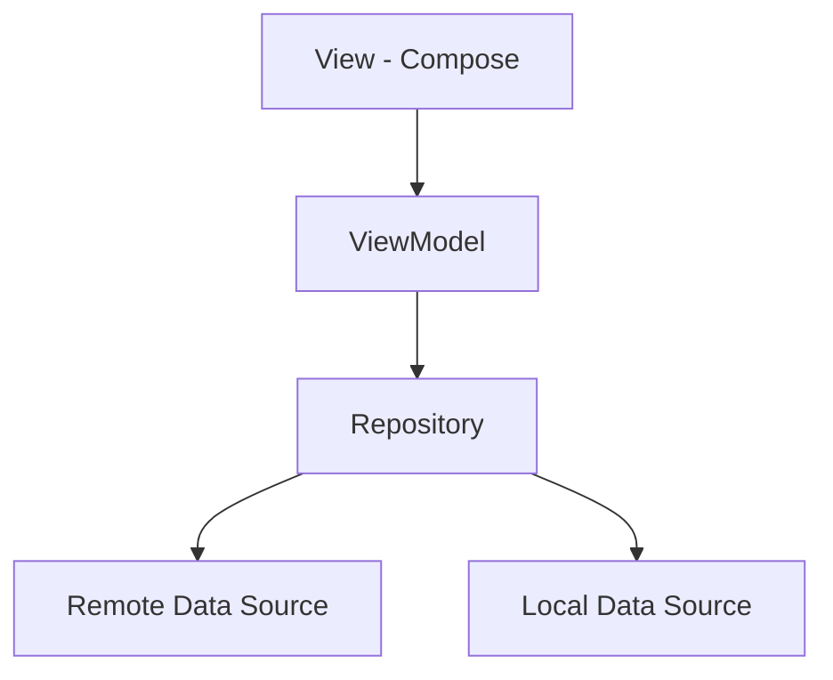

# ☀️ Afaq - آفاق
### Your Weather Horizon

[](https://kotlinlang.org)
[](https://developer.android.com)
[](https://opensource.org/licenses/MIT)
[](https://www.android.com)
[](https://openweathermap.org/api)

*A beautiful, feature-rich Android weather app with native Arabic support, offline caching, and smart alerts.*

---


☀️ 🌤️ 🌧️ ⛈️ 🌙 🌍

</div>

---

## 📑 Table of Contents
- [About the App](#-about-the-app)
- [Screenshots](#-screenshots)
- [Features](#-features)
- [Tech Stack](#-tech-stack)
- [Architecture](#-architecture)
- [Getting Started](#-getting-started)
- [API Reference](#-api-reference)
- [Testing](#-testing)
- [Localization](#-localization)
- [Contributing](#-contributing)
- [License](#-license)
- [Contact](#-contact)

---

## 📖 About the App
**Afaq (آفاق)**, which translates to "Horizons" in Arabic, is a professional-grade weather application designed to keep you ahead of the elements. Whether you're planning your day or tracking a storm, Afaq provides precision data with a stunning user interface.

It was built to showcase modern Android development practices, emphasizing:
- **Clean Architecture** for scalability.
- **Full RTL support** for a first-class Arabic experience.
- **Offline Reliability** so you're never left in the dark.

---


## 📸 Screenshots

<div align="center">

| Splash Screen | Splash Screen | Splash Screen | Splash Screen |
|:---:|:---:|:---:|:---:|
|  |  |  |  |

| Home Screen | Favourites | Map Screen | Alerts |
|:---:|:---:|:---:|:---:|
|  |  |  |  |

| Notification | Map Selection | Dark Mode | Arabic RTL |
|:---:|:---:|:---:|:---:|
|  |  |  |  |

</div>

---

## ✨ Features
- 🛰️ **Real-time Data**: Live updates via the OpenWeatherMap API.
- 📅 **Hourly Forecast**: detailed 5-day / 3-hour interval weather breakdown.
- 📍 **Smart Location**: Automatic GPS detection or manual selection via interactive **OSMDroid Map**.
- 🔔 **Intelligent Alerts**: Set custom alarms or notifications for specific weather conditions.
- 🕰️ **Background Sync**: Powered by **WorkManager** for periodic weather updates.
- 💾 **Offline Ready**: Persistent caching using **Room** and **DataStore Preferences**.
- 🌍 **Native Localization**: Full English & Arabic support with localized numerals and RTL layouts.
- 🎨 **Modern UI**: **Jetpack Compose** with Material 3 and **Glassmorphism** iconography.
- 🌗 **Adaptive Themes**: Seamless Dark and Light mode transitions.
- 📏 **Unit Conversion**: Support for Temperature (C/F/K) and Wind Speed (m/s, mph).
- 🎬 **Polished Experience**: Lottie splash animations with sound effects.

---

## 🛠 Tech Stack

| Technology | Version | Purpose |
|:---|:---|:---|
| **Kotlin** | 2.0.21 | Primary Programming Language |
| **Jetpack Compose** | Latest | Declarative UI Framework |
| **Material 3** | 1.2.x | Modern UI Design System |
| **Retrofit** | 2.9.0 | REST API Networking |
| **Room** | 2.7.0 | Local Database & Persistence (KSP) |
| **DataStore** | 1.0.0 | User Preferences Caching |
| **OSMDroid** | 6.1.17 | Interactive OpenStreetMap Implementation |
| **WorkManager** | 2.9.0 | Background & Periodic Task Scheduling |
| **Coil** | 2.6.0 | Image Loading & Caching |
| **Lottie** | 6.6.1 | Smooth Vector Animations |
| **Coroutines** | 1.7.3 | Asynchronous Programming |

---

## 🏗 Architecture
The project follows **Clean Architecture** principles and the **MVVM** pattern to ensure a decoupled and testable codebase.

### MVVM Pattern


### Folder Structure
```text
data/
├── alarm/         # AlertEntity, AlertDao, AlertRepo
├── favourite/     # FavouriteEntity, FavouriteDao, FavouriteRepo
├── home/          # Weather, Forecast, HomeRepo, WeatherDataStore
├── location/      # LocationRepository, LocationDataSource
├── network/       # RetrofitClient, AuthInterceptor
├── settings/      # SettingsRepo, AppSettings, DataStore
└── db/            # AppDatabase (Room)

presentation/
├── alarm/         # AlertViewModel, AlarmsScreen
├── connectivity/  # NetworkViewModel, NetworkObserver
├── favourites/    # FavouriteViewModel, FavouritesScreen, MapScreen
├── home/          # HomeViewModel, HomeScreen, WeatherCard
├── navigation/    # AppNavigation, BottomNavBar, Routes
├── settings/      # SettingsViewModel, SettingsScreen
├── splash/        # SplashScreen, SplashContent
└── theme/         # Design System (Color, Theme, Type)

services/
├── alarms/        # AndroidAlarmManager, IAlarmService
├── notification/  # NotificationService, NotificationServiceImpl
├── receivers/     # AlarmReceiver
└── workmanager/   # WeatherAlertWorker, WorkManagerScheduler
```

---

## 🚀 Getting Started

### Prerequisites
- Android Studio Ladybug or newer.
- An [OpenWeatherMap API Key](https://openweathermap.org/api).

### Installation
1. **Clone the repository:**
   ```bash
   git clone https://github.com/yourusername/afaq.git
   ```
2. **Open in Android Studio:**
   Wait for the project to sync and build.

3. **Add your API Key:**
   Open `local.properties` in the root folder and add:
   ```properties
   API_KEY=your_openweathermap_api_key
   ```

4. **Run the app:**
   Select your device and click **Run**.

---

## 📡 API Reference
Afaq integrates with the OpenWeatherMap API:

| Endpoint | Method | Description |
|:---|:---|:---|
| `/weather` | `GET` | Fetch current weather data for a specific location. |
| `/forecast` | `GET` | Fetch 5-day / 3-hour forecast data. |

---

## 🧪 Testing
The project includes unit and instrumentation tests to ensure reliability:
- **JUnit 4**: Framework for core logic testing.
- **MockK**: Library for mocking dependencies.
- **Robolectric**: For running Android-specific tests on the JVM.

**Run Unit Tests:**
```bash
./gradlew test
```
**Run Instrumentation Tests:**
```bash
./gradlew connectedAndroidTest
```

---

## 🌐 Localization
Afaq is fully localized for a global audience.

| Language | Code | RTL Support | Localized Digits |
|:---|:---:|:---:|:---:|
| **English** | `en` | ❌ | Standard |
| **Arabic** | `ar` | ✅ | Native Arabic Numerals |

---

## 🤝 Contributing
Contributions are welcome! 
1. Fork the Project.
2. Create your Feature Branch (`git checkout -b feature/AmazingFeature`).
3. Commit your Changes (`git commit -m 'Add some AmazingFeature'`).
4. Push to the Branch (`git push origin feature/AmazingFeature`).
5. Open a Pull Request.

---

## 📜 License
Distributed under the MIT License. See `LICENSE` for more information.

---

## ✉️ Contact

<p align="center">
  
</p>

<p align="center">
  <b>Afaq Development Team</b>
</p>

<p align="center">
  <a href="https://github.com/Moazosama2004">GitHub</a> •
  <a href="mailto:moazosama204@gmail.com">Email</a>
</p>
---

<div align="center">
  <sub>Built with ❤️ and Kotlin Compose.</sub>
</div>
